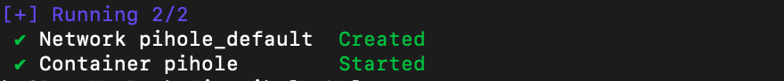
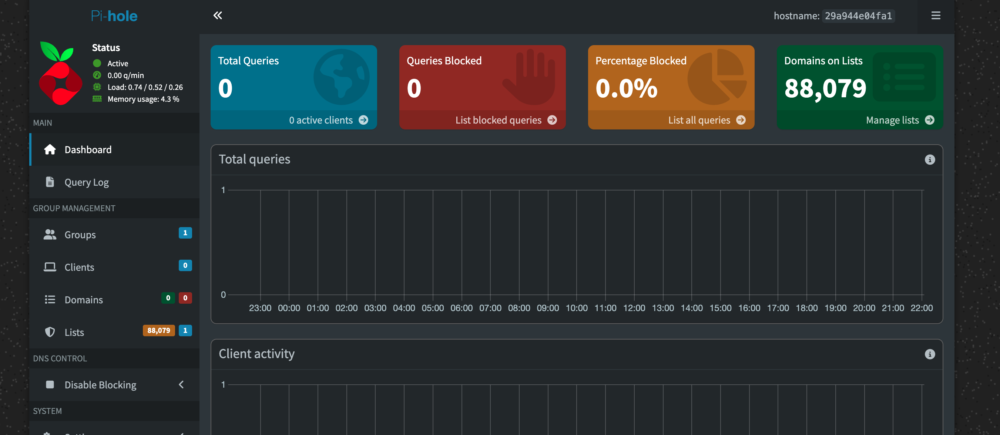

1. Grab a spare laptop (or a Raspberry Pi if you want to feel extra fancy).
    
2. Make sure Docker is installed on that machine. (Or use a virtual machine if you like extra layers of abstraction.)
    
3. Create a new folder — call it `pihole` or whatever sparks joy.
    
4. Hop into that folder.
    
5. Create a file named `docker-compose.yml`.
    
6. Paste the config below into your YAML file. (Or grab the official version from Pi-hole’s docs if you trust them more: [https://docs.pi-hole.net/docker/](https://docs.pi-hole.net/docker/))
    
7. Run `docker compose up -d` and let the magic happen.
    

### After you run the command

You should see something like this:  


### Accessing the GUI

Open your browser and head to:  
**[http://localhost/admin/login](http://localhost/admin/login)**

### Set your DNS

Point your device’s DNS to the IP address of the machine running Pi-hole — boom, you’re now the master of your own DNS destiny.



### One more thing

Feel free to change the password in your YAML file before launching Docker Compose.  
Default suggestion: **"correct horse battery staple"** — because security _and_ vibes.
```
# More info at https://github.com/pi-hole/docker-pi-hole/ and https://docs.pi-hole.net/
services:
  pihole:
    container_name: pihole
    image: pihole/pihole:latest
    ports:
      # DNS Ports
      - "53:53/tcp"
      - "53:53/udp"
      # Default HTTP Port
      - "80:80/tcp"
      # Default HTTPs Port. FTL will generate a self-signed certificate
      - "443:443/tcp"
      # Uncomment the below if using Pi-hole as your DHCP Server
      #- "67:67/udp"
      # Uncomment the line below if you are using Pi-hole as your NTP server
      #- "123:123/udp"
    environment:
      # Set the appropriate timezone for your location from
      # https://en.wikipedia.org/wiki/List_of_tz_database_time_zones, e.g:
      TZ: 'Europe/London'
      # Set a password to access the web interface. Not setting one will result in a random password being assigned
      FTLCONF_webserver_api_password: 'correct horse battery staple'
      # If using Docker's default `bridge` network setting the dns listening mode should be set to 'ALL'
      FTLCONF_dns_listeningMode: 'ALL'
    # Volumes store your data between container upgrades
    volumes:
      # For persisting Pi-hole's databases and common configuration file
      - './etc-pihole:/etc/pihole'
      # Uncomment the below if you have custom dnsmasq config files that you want to persist. Not needed for most starting fresh with Pi-hole v6. If you're upgrading from v5 you and have used this directory before, you should keep it enabled for the first v6 container start to allow for a complete migration. It can be removed afterwards. Needs environment variable FTLCONF_misc_etc_dnsmasq_d: 'true'
      #- './etc-dnsmasq.d:/etc/dnsmasq.d'
    cap_add:
      # See https://github.com/pi-hole/docker-pi-hole#note-on-capabilities
      # Required if you are using Pi-hole as your DHCP server, else not needed
      - NET_ADMIN
      # Required if you are using Pi-hole as your NTP client to be able to set the host's system time
      - SYS_TIME
      # Optional, if Pi-hole should get some more processing time
      - SYS_NICE
    restart: unless-stopped
```